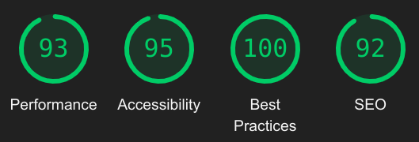

# Profile Screen

This project is a Next.js-based frontend application designed to showcase user information, including their posts and profile details. Users can view the posts they have posted, along with essential information such as username, followers count, following count, and more.

## Demo

https://terribly-tiny-tales-profile.vercel.app/


## Lighthouse Score



## Features

-   Display User Profile Information
-   Responsive Design for various screen sizes
-   Optimized For Production

## Run Locally

### Prerequisites

-   Node.js( >= 18.12 ) installed

### Installation

1. Clone the repository

```bash
  git clone https://github.com/ankitnayak09/terribly-tiny-tales.git
  cd terribly-tiny-tales
```

2. Install Dependencies:

```bash
  npm install
```

3. Start the application on local server

```bash
  npm run dev
```

The application will be available at http://localhost:3000

## Libraries and Plugins Used

-   [Next.js](https://nextjs.org/docs) : React Framework for building server-side rendered applications.
-   [Tailwind CSS](https://tailwindcss.com/docs/installation) : A utility-first CSS framework.
-   [js-abbreviation-number](https://www.npmjs.com/package/js-abbreviation-number) : Abbreviate numbers in javascript
-   [react-icons](https://react-icons.github.io/react-icons/) : Using Predefined Icons

## Project Structure

-   `pages/`: Contains Next.js pages that define the different routes of the application.
-   `components/`: Reusable React components used throughout the project.
-   `styles/`: Holds CSS styles for components and pages.
-   `public/`: Static assets like images or fonts and hardcoded-dummy json data.

## Key Files

-   `pages/index.js`: The main entry point defining the homepage of the application.
-   `components/Navbar.js`: A reusable component for the page Navbar.
-   `components/Profile/index.js`: Component responsible for rendering the user profile section.
-   `components/Posts/Post.js`: Component responsible for rendering individual post cards.
-   `components/Posts/StatsCard.js`: A resusable Component responsible for rendering different types of cards i.e followers, following, likes, stars, views of posts, etc.
-   `styles/globals.css`: Global styles applied throughout the application.

## Custom Components

### `Navbar.js`

The `Navbar` Component Renders at the top of the page depicting the logo and the button having the text Courses.

```js
import Image from "next/image";

export default function Navbar() {
	return (
		<nav className="flex justify-between items-center px-5 py-2 bg-[#111111FF]">
			<div className="flex gap-2 items-center logo uppercase text-[#E8E8E8FF] font-medium tracking-[.25rem]">
				<Image
					src="./logo.svg"
					alt=""
					className="w-[24px]"
					width="24"
					height="24"
				/>
				<div className="border border-transparent border-l-orangeYellow pl-2 text-xs">
					Stories
				</div>
			</div>
			<button className="bg-orangeYellow text-[#462000FF] font-bold p-1 px-2 rounded-md">
				Courses
			</button>
		</nav>
	);
}
```

### `StatsCard.js`

The `StatsCard` component represents an Different Types of stats based on the props value . I have utilized the `abbreaviateNumber` function to convert the numbers into words . i.e `27000 => 2K`.
Used Switch Case to Return different Icons Based on the props.

```js
import Likes from "@/components/icons/Likes";
import Loved from "@/components/icons/Loved";
import Stars from "@/components/icons/Stars";
import Views from "@/components/icons/Views";
import { abbreviateNumber } from "js-abbreviation-number";

export default function StatsCard({ statsFor, statsValue }) {
	if (statsFor === "followers" || statsFor === "following") {
		return (
			<p className="text-gray text-center mt-2 capitalize">
				<span className="block border-2 border-gray rounded-md text-center text-base font-bold opacity-80 px-4">
					{statsValue}
				</span>
				{statsFor}
			</p>
		);
	} else {
		return (
			<>
				<div className="text-slate-600 flex items-center">
					{(() => {
						switch (statsFor) {
							case "stars":
								return <Stars />;
							case "likes":
								return <Likes />;
							case "views":
								return <Views />;
							case "loved":
								return <Loved />;
						}
					})()}
					<span className="text-sm ml-1">
						{abbreviateNumber(statsValue)}
					</span>
				</div>
			</>
		);
	}
}
```

### `Post.js`

The `Post` component represents an individual Post displaying the information about the post content, author, time, views, etc.
Based on the content-type the content are rendered differently.

```js
import Likes from "@/components/icons/Likes";

export default function Post({
	title,
	contentType,
	content,
	topic,
	postBy,
	listHeading,
	views,
	readingTime,
	date,
}) {
	return (
		<div className="border-2 border-transparent border-b-slate-200 py-5 px-4">
			<div className="flex justify-between items-center mb-2">
				<h2 className="font-bold text-lg">{title}</h2>
				<Likes />
			</div>
			{/* Render Content Based on Content Type */}
			{(() => {
				switch (contentType) {
					case "Paragraph":
						return (
							<>
								{content.map((para, index) => (
									<p
										className="text-sm text-slate-700 my-6 line-clamp-2"
										key={index}
									>
										{para}
									</p>
								))}
							</>
						);
					case "List":
						return (
							<>
								<p className="my-4">{listHeading}</p>
								<ul className="list-disc list-inside text-sm text-slate-700 mb-6">
									{content.map((item, index) => (
										<li className="list-none" key={index}>
											- {item}
										</li>
									))}
								</ul>
							</>
						);
				}
			})()}
			<div className="flex justify-between">
				<p className="text-xs">
					<span className="text-cyan-500 font-medium">{topic}</span>{" "}
					<span className="text-[#7E7E7EFF] font-medium">
						by {postBy}
					</span>
				</p>
				<p className="text-[#7E7E7EFF] text-xs">
					{date} &#183; {readingTime} &#183; {views} Views
				</p>
			</div>
		</div>
	);
}
```

## Optimizations

-   Utilized Next.js `Image` component for image optimization, reducing First Contentful Paint (FCP) by efficiently loading and displaying images.
-   Named icon images in alignment with the corresponding props for seamless rendering and improved code readability.
-   Implemented the `alt` attribute for images to enhance accessibility by providing descriptive text for screen readers.
